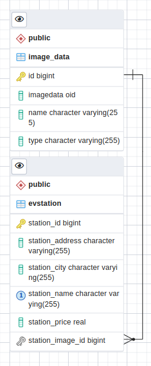

# EV Station Backend Application

This app is build using Spring boot, hibernate and postgresSQL

It can perform CRUD operation on ev station details.
Also has image upload option for the ev Station.

## **ERD**

